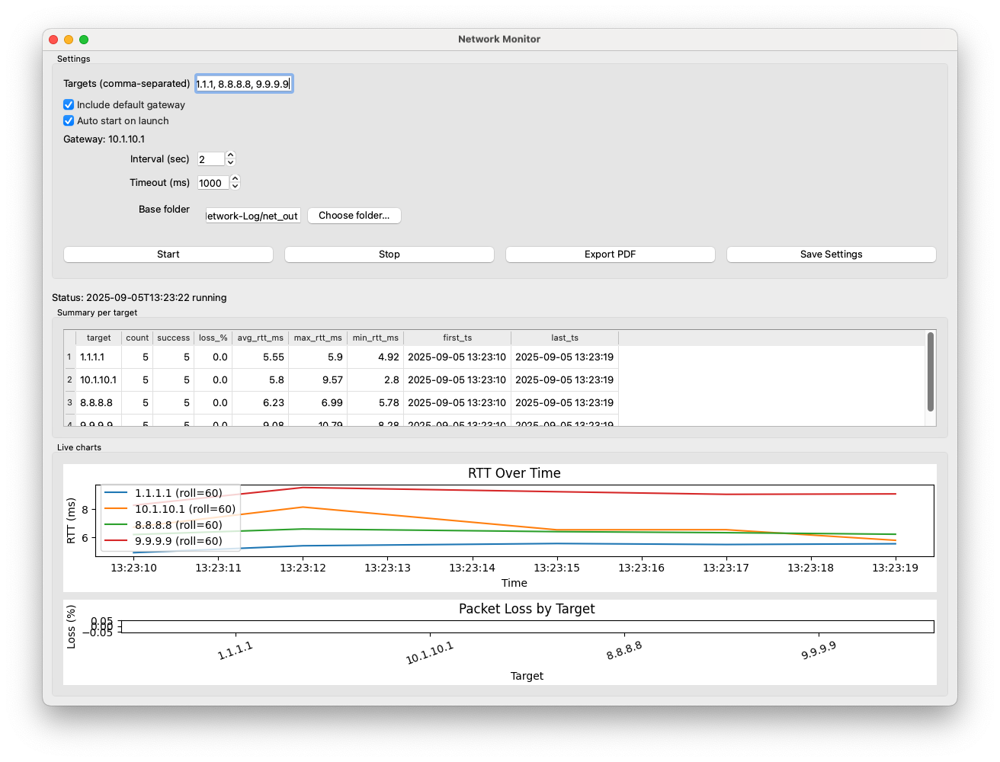

# Network Connectivity Monitor

Monitor network connectivity by pinging multiple targets, view live RTT/loss charts, and export hourly PDF reports.

## Quick Start

### 1. Install [uv](https://github.com/astral-sh/uv?utm_source=chatgpt.com)

**macOS/Linux**

```bash
curl -LsSf https://astral.sh/uv/install.sh | sh
```

**Windows (PowerShell)**

```powershell
irm https://astral.sh/uv/install.ps1 | iex
```

### 2. Create & activate virtualenv

```bash
uv venv .venv
source .venv/bin/activate   # macOS/Linux
.venv\Scripts\activate      # Windows
```

### 3. Install dependencies

```bash
uv pip install -r requirements.txt
```

(or add manually: `uv add PySide6 pandas matplotlib reportlab netifaces`)

### 4. Run

```bash
uv run python main.py
```



---

## Config

`config.json` (auto-managed by the app):

```json
{
  "auto_start": false,
  "include_gateway": true,
  "targets": ["1.1.1.1", "8.8.8.8"],
  "interval_sec": 2,
  "timeout_ms": 1000,
  "base_dir": "net_out"
}
```

---

## Outputs

- **CSV logs**: `net_out/YYYY-MM-DD/net_log.csv`
- **PDF reports**: `net_out/YYYY-MM-DD/report_YYYYMMDD_HH00.pdf`

[PDF Report](docs/report_20250905_1300.pdf)


Reports include:

- Summary per target
- RTT over time
- Packet loss by target
- Loss over time (timeline)
- Top lossy periods
- Loss events table

---

## Build Executable (optional)

```bash
uv add pyinstaller
uv run pyinstaller --onefile --windowed main.py
```